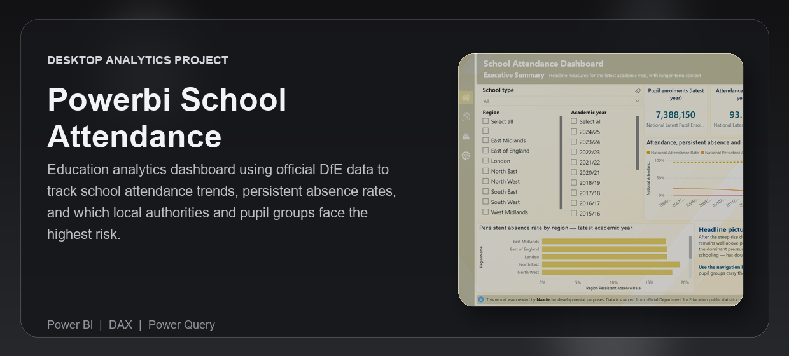
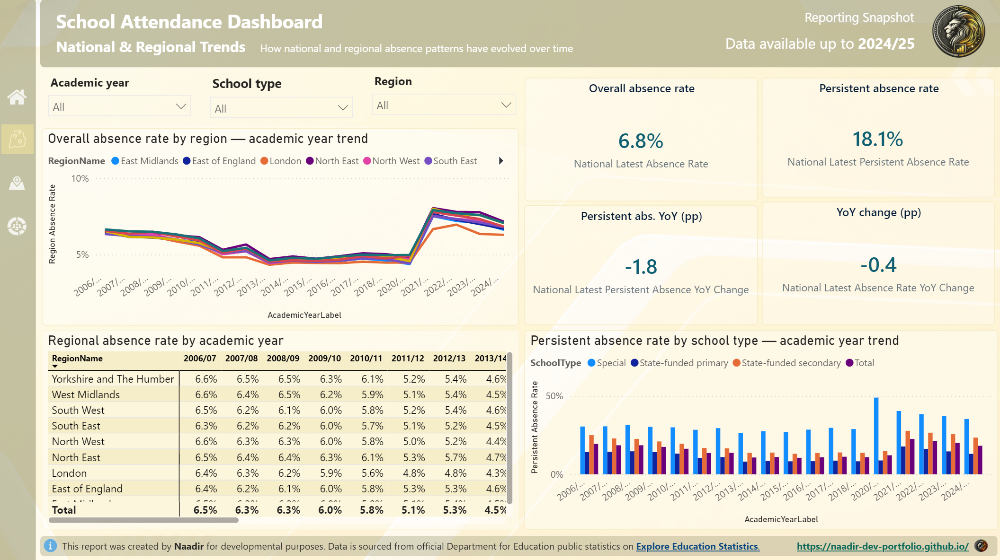
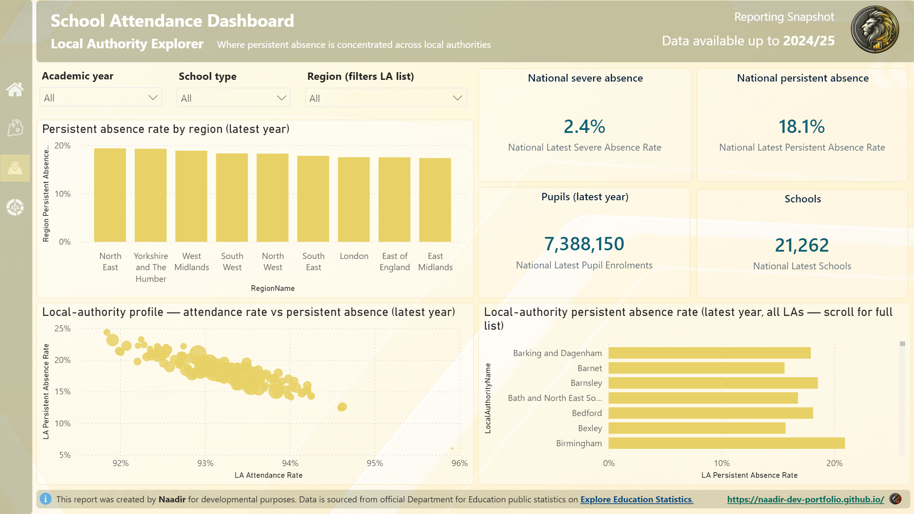
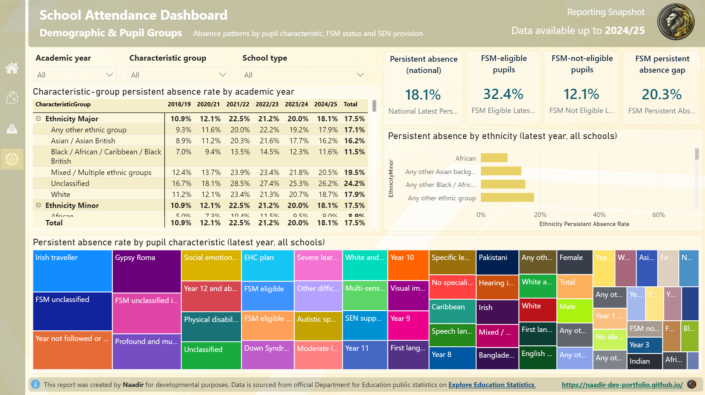

---
<div align="center">


<br /><br />

<p><strong>Public-sector dashboard tracking school attendance and absence pressure across England - showing whether attendance is improving, where persistent absence is most severe, and which pupil groups face the highest risk.</strong></p>

<p>Built for education analysts, local authority teams, and decision-makers who need a clear view of absence risk without manually combining DfE releases.</p>

<p><strong>Technical documentation:</strong> <a href="https://naadir-dev-portfolio.github.io/powerbi-school-attendance-dashboard/">View the published report documentation</a></p>

<p>
  <a href="#overview">Overview</a> |
  <a href="#what-problem-it-solves">What It Solves</a> |
  <a href="#feature-highlights">Features</a> |
  <a href="#screenshots">Screenshots</a> |
  <a href="#quick-start">Quick Start</a> |
  <a href="#tech-stack">Tech Stack</a>
</p>

<h3><strong>Made by Naadir | May 2026</strong></h3>

</div>

---

## Overview

This Power BI project uses official Department for Education absence data to track school attendance, overall absence, persistent absence, and severe absence across England. It brings together national, regional, local authority, school type, pupil characteristic, ethnicity, and free school meal breakdowns into one presentation-ready dashboard.

The report supports a decision-maker workflow: start with the national headline picture, move into regional trends, identify local authorities under the most pressure, then drill into pupil groups where persistent absence is concentrated. It is built to answer whether attendance is improving, where risk is highest, and which groups need closer attention.

The practical outcome is a cleaner way to explain school absence pressure using official data. Instead of reviewing separate CSVs and static tables, the user can compare trends, locations, and pupil groups through a curated semantic model and structured report pages.

## What Problem It Solves

- Removes the need to manually combine multiple DfE absence datasets before analysis
- Improves the default CSV workflow by turning raw releases into model-ready Power BI tables
- Makes it clearer whether attendance is stabilising, worsening, or improving after the pandemic period
- Gives a faster way to compare national, regional, local authority, and pupil-group pressure in one report

### At a glance

| Track | Analyse | Compare |
|---|---|---|
| Attendance, absence, persistent absence, and severe absence | National trends, regional patterns, and pupil-group risk | England, regions, local authorities, school types, and pupil characteristics |
| Official DfE academic-year and termly absence data | Attendance and absence rates, year-on-year movement, latest-year pressure | Latest year against historical trend and regional/local authority variation |
| Local PBIP refresh workflow | Power BI report pages, KPI cards, trend charts, ranked tables, and scatter comparisons | Persistent absence, severe absence, FSM gaps, ethnicity patterns, and school-type differences |

## Feature Highlights

- **Executive summary**, gives the latest national attendance, persistent absence, severe absence, and pupil enrolment picture in one view
- **National and regional trends**, shows how overall absence and persistent absence have changed by academic year and school type
- **Local authority explorer**, ranks and profiles local areas so high-pressure authorities can be identified quickly
- **Demographic deep dive**, highlights absence risk by pupil characteristic, ethnicity, and free school meal status
- **Curated semantic model**, separates date, geography, school type, pupil characteristics, and fact tables for cleaner analysis
- **Repeatable data pipeline**, downloads official DfE CSVs, rebuilds curated tables, regenerates TMDL, and restores report-specific measures

### Core capabilities

| Area | What it gives you |
|---|---|
| **Attendance monitoring** | A clear national view of attendance, absence, persistent absence, and severe absence over time |
| **Geographic comparison** | Regional and local authority analysis to show where absence pressure is concentrated |
| **Pupil-group risk analysis** | Breakdowns by pupil characteristic, ethnicity, and FSM status to show which groups carry higher persistent-absence risk |
| **Model refresh workflow** | A script-driven path from official DfE source files to refreshed Power BI-ready tables and measures |

## Screenshots

<details>
<summary><strong>Open screenshot gallery</strong></summary>

<br />

<div align="center">
  
  <br /><br />
  
  <br /><br />
  
</div>

</details>

## Quick Start

```bash
# Clone the repo
git clone https://github.com/Naadir-Dev-Portfolio/powerbi-school-attendance-dashboard.git
cd powerbi-school-attendance-dashboard

# Install dependencies
pip install pandas

# Run
python "Source Data/build_school_attendance_project.py"
```

No API keys are required. The project uses public, no-account-required Department for Education CSV downloads. After running the script, open `School Attendance Dashboard.pbip` in Power BI Desktop and refresh the model. If the raw CSVs already exist, the script reuses them; delete files in `Source Data/Raw` before running if you want to force a fresh download.

## Tech Stack

<details>
<summary><strong>Open tech stack</strong></summary>

<br />

| Category | Tools |
|---|---|
| **Primary stack** | DAX | Power Query |
| **UI / App layer** | Power BI Desktop | PBIP report files |
| **Data / Storage** | CSV | TMDL | JSON | Official DfE public datasets |
| **Automation / Integration** | Python acquisition and curation scripts | Explore Education Statistics CSV endpoints | Local validation scripts |
| **Platform** | Windows | Power BI Desktop |

</details>

## Architecture & Data

<details>
<summary><strong>Open architecture and data details</strong></summary>

<br />

### Application model

The project starts with official Department for Education absence CSVs downloaded into `Source Data/Raw`. A Python build script cleans and consolidates the source releases into curated CSV tables for date, term, geography, school type, pupil characteristics, annual attendance, termly attendance, characteristic-level absence, and ethnicity/FSM absence.

Power BI reads the curated CSV layer into a PBIP semantic model. TMDL files define the tables, relationships, and DAX measures used by the report. The report pages then use those measures to present a structured flow: executive summary, national and regional trend analysis, local authority comparison, and demographic/pupil group deep dive.

### Project structure

```text
powerbi-school-attendance-dashboard/
+-- School Attendance Dashboard.pbip
+-- School Attendance Dashboard.Report/
+-- School Attendance Dashboard.SemanticModel/
+-- Source Data/
|   +-- build_school_attendance_project.py
|   +-- Raw/
|   +-- Curated/
+-- .build/
|   +-- check_refs.py
|   +-- validate.py
|   +-- add_measures.py
+-- README.md
+-- repo-card.png
+-- portfolio/
    +-- powerbi-school-attendance.json
    +-- powerbi-school-attendance.webp
    +-- Screen1.png
    +-- Screen2.png
    +-- Screen3.png
```

### Data / system notes

- Source data comes from official Department for Education Explore Education Statistics CSV endpoints for pupil absence in schools in England.
- The project is local-first: raw files, curated CSVs, PBIP report files, TMDL model files, and validation scripts all live in the repo.
- Validation scripts check PBIP structure and visual field references so missing measures or broken bindings can be caught before reopening Power BI Desktop.

</details>

## Contact

Questions, feedback, or collaboration: naadir.dev.mail@gmail.com

<sub>DAX | Power Query</sub>

---
